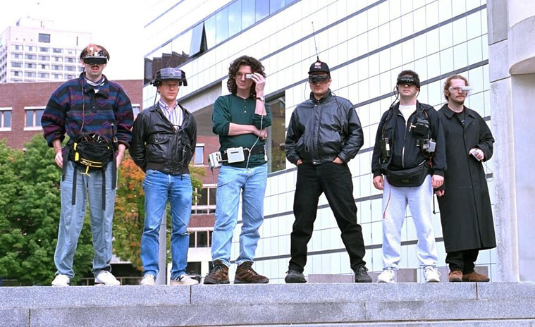

name: inverse
layout: true
class: inverse

---

# Oculus Rift in OpenFrameworks

- VR in general
- Rift in OpenFrameworks
- Examples of some projects

---

class: center

# Virtual Reality


---

## How does VR work?

- VR: fooling your senses and subconscious.
 - Information delivered directly to your perceptual systems in the way that they have evolved to receive it.
- Qualitatively different to other forms of media that you engage with intellectually, VR works on a deeper, more subconscious level.
 
---

- Most media to date (writing/painting/photography/film) is quite abstract in that you don't directly experience it, it's a symbolic representation that you then intellectualise to understand its meaning, or the feeling that it is trying to communicate.
- VR does a run-around these abstract thought processes and taps directly into your more primal senses, making you 'feel' like you're in a space, seeing something unfold with your own eyes. Where other media relies on a *suspension of disbelief* to let you empathise with the work, VR 'presence' requires a *suspension of belief* - you need to actively remind yourself that it's not real because your perceptual system is telling you that it is.
- *Presence*: The point where enough of your subconscious systems are sensing that you are having an experience, that as far as your lizard brain is concerned, you are having that experience. Your conscious brain may disagree, but it's a powerful sensation. The more senses that are engaged (and agree), and the higher definition the engagement, the closer to *presence* an experience becomes.
- "Why Virtual Reality Isn't (Just) the Next Big Platform : Michael Abrash & Dov Katz of Oculus VR" [https://www.youtube.com/watch?v=dxbh-TM5yNc]()

---

## Hardware
- Inside the DK2 headset:
 - Display (Galaxy Note 4 mobile phone screen)
 - Two plastic lenses
 - IMUs/accelerometers
 - Infra-red LEDs for positional tracking

- No longer need bulky complicated multi-element lenses to correct distortion - do it in graphics hardware

???

In order to have a VR headset, you need a screen that's small and close to your eyes. In order to do this, you need lenses that can allow you to focus on something so close. Try it with your mobile phone screen, you can't do it. These lenses used to be big, complicated and expensive.

One of the reasons why VR is finding its time now is that graphics hardware has gotten fast, and with programmable shading on the GPU, you can use cheap lenses that distort the image, but use the GPU to counteract that distortion by pre-warping the image to compensate. The rise of smartphones has driven down the cost of small, high pixel density displays, along with other sensors such as accelerometers (which are also used in phones). 


---

## Process
- Ongoing loop between Display &larr;&rarr; Sensors
- HMD shows you view of the virtual space
- Sensors read gravity direction, head position, head orientation and/or other peripherals, send to your app (sensor fusion)
- Application updates state of the virtual world, renders stereo scene with updated virtual camera
- Displays on HMD

---

## Stereo rendering for VR
- Generate two virtual cameras offset by the IPD (inter-pupillary distance)
- If the two views of an object are shifted left or right relative to each other, that shift is called parallax, or disparity. 
- Brain interprets the two images, finding correspondence between features in each eye, calculating depth based on disparity ("fusion")
- At 'infinity' no difference between eyes, up close, big difference (try it with your finger). On a practical level, 'infinity' is just the distance at which any changes in space don't translate into pixel differences
- In practice, this requires rendering your scene twice, to generate the two different images to send to each eye.

---

## Designing for stereo
- Need enough detail for your brain to pick up differences between eyes, but don't want the shapes you're looking at to be too different per eye as the brain won't be able to fuse them
- Large flat colours = little correspondence between eyes, has less of a depth effect
- Noise/aliasing different in each eye = Can create shimmering effect as each eye is looking at different patterns
- Specular highlights causing differences in images per eye. Be careful with how these are used

---

## Designing for VR
- What makes VR 'interesting' is that since it's about fooling your senses, it's much more tied in to the details and idiosyncracies of how your body operates and registers sensory input.
- The trade off for tapping more directly into your sensory perception is plenty of brand new limitations and side effects that aren't an issue in other mediums.

---

## Designing for HMDs
- Wide field of view
 - DK2 fov is roughly 90-100° - still has 'snorkelling goggles' effect
 - Pixel density of HMDs is still low when covering such a wide angular area
 - Low frame rate jumpiness amplified: A jump of 10 pixels on a desktop monitor is much less noticeable than right in front of your face

- Human visual system is very complex
 - Perception works in weird ways - most of what we call vision happens in the brain, not the eyes
 - Most visual information gathered only within a few degrees of centre of pupil (fovea)
 - Eye saccades when scanning across field of view, can lock on to objects when head is moving

---

## Judder
- Usually caused by insufficient refresh rate/FPS
- DK2 display refresh rate is 75Hz, therefore applications must be able to render consistently at **75 FPS** for a usable VR experience. Oculus Rift consumer version will be even higher at 90Hz, which will be a much better experience, but also more technically demanding to render for.
- Much better for user experience  to have less visual fidelity and hit FPS targets than have beautiful still frame visuals but jumpy rendering.
- Dropped frames cause the dreaded 'judder', where display refresh is not able to keep up with head movement

---

## What is Judder?
- Mismatch of the relative motion between virtual objects on screen and movement of eye scanning across screen (or vice versa, rotation of head while eye tracks a stationary object)
- [ visual example ]
- See: [http://blogs.valvesoftware.com/abrash/why-virtual-isnt-real-to-your-brain-judder/]()

---

## Simulator Sickness
- Conflicts between visual and bodily senses such as inner ear (like motion sickness)
- Limit accelerations to be short and infrequent. Fast, snappy accelerations seem to work better than gradual
- Never move the user's virtual camera position or orientation if not initiated by user (eg. head bobbing)
- Respect dynamics of human motion
- In games, cockpits help to provide frame of reference
- Display info in 3D space, not as fixed heads-up display

---

## VR hardware
#### Oculus DK1
- First development kit from Oculus
- Rotational tracking
- 1280x800 (640x800 / eye)

---

## VR hardware
#### Oculus/Samsung GearVR
- $250, plastic shell + lenses with IMUs, insert phone inside
- Currently the only actual released mainstream commercial VR product. Requires Samsung Galaxy Note 4, 2560x1440 (1280x1400 /eye)
- No positional tracking
- Much of the content so far seems to be spherical video
- Mobile SDK not supported by this ofx addon.

---

## VR hardware
#### Oculus DK2
- 1920x1080 (960x1080 / eye), 
- Low persistence screen (reduces smearing - pixels only illuminated for a short time)
- Positional tracking via IR camera/LEDs, computer vision

---

## VR hardware
#### HTC/Valve Vive
- Dual screen, higher resolution
- Lighthouse tracking system

---

## VR hardware
#### Oculus Rift (consumer version)
- Similar display specs to Vive
- Still using optical tracking, future input devices using optical tracking camera too

---


class: center, middle
# Oculus SDK

---

## How the SDK works

- Use hardware/tracking info to determine head position & orientation 
 - Get projection matrix from the SDK (based on fov, asymmetric frustrum)
 - Generate modelview matrix from your own camera matrix \* tracked orientation \* tracked position \* eye offset
- Render two eyes to temporary framebuffer
 - Framebuffer resolution determined by SDK, but can scale up or down to speed up rendering at expense of definition
- Run distortion shader on the framebuffer to distort the image, rendering the output to a new framebuffer, for presentation to device
- Final distorted output at resolution of device

---

## Direct vs Extended mode
- Extended mode treats the DK2 as a second display, plugged into HDMI
- Extended mode is simpler, but makes some things cumbersome
 - A bit annoying for developers to find the correct location to position your VR content
 - More importantly, problems with Vsync on some OSes. On Windows (and OS X?) the OS will only Vsync to the primary display, meaning if your primary display was a regular 60Hz monitor, the graphics would be output at 60Hz, not the DK2's actual refresh rate of 75Hz.
 - Often involves squinting through the HMD to find windows that have popped open on the wrong display
- Direct mode (Windows only), does some internal graphics driver trickery to bypass parts of the usual graphics pipeline and allow the Oculus SDK to output to the HMD directly.

---

## Further SDK versions (0.6+)
- Current version of ofxOculusDK2 only supports Oculus SDK v0.5.0.1 - last version available on Mac OS X and Linux. Oculus SDK 0.6+ Windows versions include:
 - Multiple framebuffer layers (for keeping overlays, i.e. HUD text at highest resolution, while downscaling main 3D content)
 - No more 'client distortion', all handled in SDK

---

class: center, middle
 
## Using the ofxOculusDK2 addon for OpenFrameworks

---

### In the app main class definition
Add an ofxOculusDK2 object, and make sure you're using an ofCamera (or compatible subclass) to render your scene with.

```
ofxOculusDK2 oculusRift;
ofEasyCam cam;
```

---

### In setup()
Here is where you need to initialise the DK2.

- First we connect the camera
- `oculusRift.setup()`  takes care of connecting to the SDK, initialising the hardware with default capabilities, and generating its internal framebuffer which you will be rendering to.
- `oculusRift.fullscreenOnRift()` is a helper function, which when in extended mode, tries to find the rift display and position the OF window on it, filling the screen (OS X only at the moment).

````
oculusRift.baseCamera = &cam;
oculusRift.setup();
oculusRift.fullscreenOnRift();
````

---

### In setup()
If you're using ofEasyCam, one thing that can play havoc is the 'auto distance' feature, which will push your camera out until it encompasses your scene bounds. It's better for us to have that off so we can position the camera's starting position explicitly.

````
//enable mouse;
cam.setAutoDistance(false);
cam.begin();
cam.end();
    
// set camera y to user eye height
cam.setGlobalPosition(0, oculusRift.getUserEyeHeight(), 3);

````

---

### In the main draw() function
Since we need to draw the scene twice, once for each eye, it's convenient to have all your drawing commands wrapped up into a single function. Then it's just a matter of running that function twice, inside some special functions in the addon that set up all the camera matrices correctly for each eye.

````
oculusRift.beginLeftEye();
drawScene();
oculusRift.endLeftEye();
	
oculusRift.beginRightEye();
drawScene();
oculusRift.endRightEye();
	
oculusRift.draw();
````
---

````
oculusRift.beginLeftEye();
drawScene();
oculusRift.endLeftEye();
	
oculusRift.beginRightEye();
drawScene();
oculusRift.endRightEye();
	
oculusRift.draw();
````

In more detail, `beginLeftEye()` binds the render target frame buffer so that subsequent drawing commands will render there.

It then sets up the correct view matrices for the left eye. These get multiplied on top of the transformation of the ofCamera that you're using.

The remaining functions `endLeftEye()`, `beginRightEye()`, `endRightEye()` just do the same thing, pushing and popping off the necessary matrices for each eye.

`oculusRift.draw()` then takes the rendered frame buffer, applies the distortion shader, and displays it to the HMD. The distortion is specific to each HMD, as it needs to pre-warp the image to compensate for the characteristics of the lenses used. The distortion shader may also process *TimeWarp*, to attempt to re-use out of date frames if new frames are not ready yet.

---

### Additional functionality
There are a bunch of additional features for controlling HMD/driver functionality that you can find in `ofxOculusDK2.h`. For example:
- `oculusRift.setPositionTracking(bool)` to enable or disable positional tracking.

Functions are also available for toggling aspects of the distortion (vignette, timewarp, overdrive, low persistence, etc).