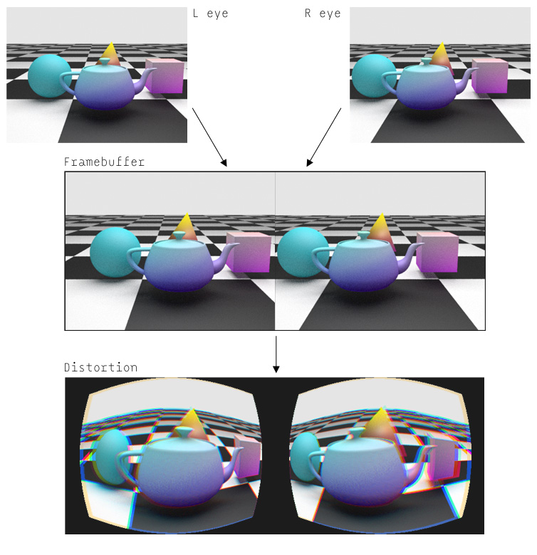

name: inverse
layout: true
class: inverse

---

class: center

# Oculus Rift in OpenFrameworks


# Matt Ebb

- VR in general
- Rift in OpenFrameworks
- Examples

---


???

- Some background on me and how I got involved with this
- Unlike others, I'm not using openFrameworks on a day to day basis
- day job doing visual effects for films, currently working at AL
- however it does involve quite a bit of creative coding, in other contexts
- It was there that I got a small taste of the Oculus Development Kit 1 when another team was using it to test a 360° video project they were working on
- from there got hooked, partly because saw potential for art/design/creative coding, not just games
- part of that market is getting big, eg. panoramic imagery/video, which I'll touch on later with a little project I've been working on.
- dabbled in openFrameworks before, decided to see if there was already support
- ofxOculusDK2 addon by James George, ported over from the DK1, working at  a basic level
- Since then I've spent a bit of time 
 - updating it for new versions new best practices of the Oculus Software development kit
 - developing extra functionality


----
class: center

# Virtual Reality

---

## How does VR work?

- VR: fooling your senses and subconscious.
 - Information delivered directly to your perceptual systems in the way that they have evolved to receive it.
- Qualitatively different to other forms of media that you engage with intellectually, VR works on a deeper, more subconscious level.
 
---

- Existing media use abstractions, not experience
- VR qualitatively different, taps directly into subconscious experience
- Old media requires *suspension of disbelief* , VR *suspension of belief* 
- "Why Virtual Reality Isn't (Just) the Next Big Platform : Michael Abrash & Dov Katz of Oculus VR" [https://www.youtube.com/watch?v=dxbh-TM5yNc]()

???

- Most media to date (writing/painting/photography/film) is quite abstract in that you don't directly experience it, it's a symbolic representation that you then intellectualise to understand its meaning, or the feeling that it is trying to communicate.
- VR does a run-around these abstract thought processes and taps directly into your more primal senses, making you 'feel' like you're in a space, seeing something unfold with your own eyes. Where other media relies on a *suspension of disbelief* to let you empathise with the work, VR 'presence' requires a *suspension of belief* - you need to actively remind yourself that it's not real because your perceptual system is telling you that it is.
- *Presence*: The point where enough of your subconscious systems are sensing that you are having an experience, that as far as your lizard brain is concerned, you are having that experience. Your conscious brain may disagree, but it's a powerful sensation. The more senses that are engaged (and agree), and the higher definition the engagement, the closer to *presence* an experience becomes.


---

## Hardware
- Inside the DK2 headset:
 - Display (Galaxy Note 4 mobile phone screen)
 - Two plastic lenses
 - IMUs/accelerometers for orientation
 - Infra-red LEDs for positional tracking

- No longer need bulky complicated multi-element lenses to correct distortion - do it in graphics hardware

???

In order to have a VR headset, you need a screen that's small and close to your eyes. In order to do this, you need lenses that can allow you to focus on something so close. Try it with your mobile phone screen, you can't do it. These lenses used to be big, complicated and expensive.

One of the reasons why VR is finding its time now is that graphics hardware has gotten fast, and with programmable shading on the GPU, you can use cheap lenses that distort the image, but use the GPU to counteract that distortion by pre-warping the image to compensate. The rise of smartphones has driven down the cost of small, high pixel density displays, along with other sensors such as accelerometers (which are also used in phones). 


---

## Process
- Ongoing loop between Display &larr;&rarr; Sensors
 - HMD shows you view of the virtual space
 - Sensors read gravity direction, head position, head orientation and/or other peripherals, send to your app (sensor fusion)
 - Application updates state of the virtual world, renders stereo scene with updated virtual camera
 - Displays on HMD

---

## Stereo rendering for VR
- Stereo - another layer of fooling your senses
- If the two views of an object are shifted left or right relative to each other, that shift is called parallax, or disparity. 
- Brain interprets the two images, finding correspondence between features in each eye, calculating depth based on disparity ("fusion")
- At 'infinity' no difference between eyes, up close, big difference (try it with your finger).
- In practice, this requires rendering your scene twice, to generate the two different images to send to each eye.

???

A big part of VR is showing stereo (binocular 3d) imagery to your eyes, so it helps to know a bit about how that works.

---

## Designing for stereo
- Need enough detail for your brain to pick up differences between eyes, but don't want the shapes you're looking at to be too different per eye as the brain won't be able to fuse them
- Large flat colours = little correspondence between eyes, has less of a depth effect
- Noise/aliasing different in each eye = Can create shimmering effect as each eye is looking at different patterns
- Specular highlights causing differences in images per eye. Be careful with how these are used

---

## Designing for VR
- What makes VR 'interesting' is that since it's about fooling your senses, it's much more tied in to the details and idiosyncracies of how your body operates and registers sensory input.
- The trade off for tapping more directly into your sensory perception is plenty of brand new limitations and side effects that aren't an issue in other mediums.

---

## Designing for HMDs
- Wide field of view vs monitors small
 - DK2 fov is roughly 90-100° - still has 'snorkelling goggles' effect
 - Currently looks 'low res', pixel density of HMDs is still low when covering such a wide angular area
 - Low frame rate jumpiness amplified: A jump of 10 pixels on a desktop monitor is much less noticeable than right in front of your face

---

## Simulator Sickness
- Conflicts between visual and bodily senses such as inner ear (like motion sickness)
- Limit accelerations to be short and infrequent. Fast, snappy accelerations seem to work better than gradual
- Never move the user's virtual camera position or orientation if not initiated by user (eg. head bobbing)
- Respect dynamics of human motion
- In games, cockpits help to provide frame of reference
- Display info in 3D space, not as fixed heads-up display

---


## Judder
- Mismatch of the relative motion between virtual objects on screen and movement of eye scanning across screen (or vice versa, rotation of head while eye tracks a stationary object)
- Caused by dropped frames, insufficient refresh rate/FPS, not able to keep up with head movements
- DK2 display refresh rate is 75Hz, therefore applications must be able to render consistently at **75 FPS** for a usable VR experience. Oculus Rift consumer version will be even higher at 90Hz :o
- Much better for user experience  to have less visual fidelity and hit FPS targets than have beautiful still frame visuals but jumpy rendering.
- All kinds of tricky problems with Vertical Sync
- [ visual example ]
- See: [http://blogs.valvesoftware.com/abrash/why-virtual-isnt-real-to-your-brain-judder/]()
- How VSync works: http://doc-ok.org/?p=1057

---

class: center, middle
# Oculus SDK

---

## How the SDK works

- Use hardware/tracking info to determine head position & orientation 
 - Get projection matrix from the SDK (based on fov, asymmetric frustrum)
 - Generate modelview matrix from your own camera matrix \* tracked orientation \* tracked position \* eye offset
- Render two eyes to temporary framebuffer
 - Framebuffer resolution determined by SDK, but can scale up or down to speed up rendering at expense of definition
- Run distortion shader on the framebuffer to distort the image, rendering the output to a new framebuffer, for presentation to device
- Final distorted output at resolution of device
- Most of these details are wrapped up and done for you in the ofxOculusDK2 addon

---



---

## Other SDK versions (0.6+)
- Current version of ofxOculusDK2 only supports Oculus SDK v0.5.0.1 - last version available on Mac OS X and Linux. Oculus SDK 0.6+ Windows versions include:
 - Multiple framebuffer layers (for keeping overlays, i.e. HUD text at highest resolution, while downscaling main 3D content)
 - No more 'client distortion', all handled in SDK
 - Windows 'Direct Mode'

???

The windows version also has "Direct Mode", which bypasses parts of the windows graphics system to allow SDK to draw to the HMD directly, solving a bunch of problems with VSync.

---

class: center, middle
 
# Using ofxOculusDK2 for OpenFrameworks

---

### In the app main class definition
- Add an ofxOculusDK2 object
- Need an ofCamera (or compatible subclass) to render your scene with

```
ofxOculusDK2 oculusRift;
ofCamera cam;
```

### In setup()
Here is where you need to initialise the DK2.

- Tell the oculusRift object which camera to render from
- `oculusRift.setup()`  takes care of connecting to the SDK, initialising the hardware with default capabilities, and generating its internal framebuffer which you will be rendering to.

````
oculusRift.baseCamera = &cam;
oculusRift.setup();
````

---

### In the main draw() function
Since we need to draw the scene twice, once for each eye, it's convenient to have all drawing commands wrapped up into a single function (drawScene).

````
oculusRift.beginLeftEye();
drawScene();
oculusRift.endLeftEye();
	
oculusRift.beginRightEye();
drawScene();
oculusRift.endRightEye();
	
oculusRift.draw();
````

- `beginLeftEye()` binds the render target frame buffer
- sets up correct view matrices for the left eye (and ofCamera matrix)
- The remaining functions `endLeftEye()`, `beginRightEye()`, `endRightEye()` just do the same thing, pushing and popping off the necessary matrices for each eye.
- `oculusRift.draw()` then takes the rendered frame buffer, applies the distortion shader, and displays it to the HMD.

---

### Additional functionality
There are a bunch of additional features for controlling HMD/driver functionality that you can find in `ofxOculusDK2.h`. For example:
- `oculusRift.fullscreenOnRift()`
- `oculusRift.setPositionTracking()`: positional tracking on/off.

Functions are also available for toggling aspects of the distortion (vignette effect, other characterisics like timewarp, overdrive, low persistence, etc).

#### Gaze/Mouse
- Screen to world (and vice versa) matrix conversions, in order to facilitate mouse and/or gaze direction picking

When converting from world space to screen space, it uses the average of the two eyes' matrices.


---

class: center middle

# Example: Simple Box

---

### In setup()
````
// OF init
ofEnableDepthTest();
ofSetVerticalSync( false );
ofEnableNormalizedTexCoords();
    
oculusRift.baseCamera = &cam;
oculusRift.setup();
oculusRift.fullscreenOnRift();
    
// Add a simple box to look at
box = ofBoxPrimitive();
box.set(0.2);
box.enableTextures();

// load the OF logo from disk ready to texture with
ofLogo.loadImage("of.png");

// position camera just slightly away from the box
cam.setAutoDistance(false);
cam.setGlobalPosition(0, 0.3, 0.75);
````

---

### in drawScene()

````
ofLogo.getTextureReference().bind();
box.draw();
ofLogo.getTextureReference().unbind();
````

### in draw()
````
oculusRift.beginLeftEye();
drawScene();
oculusRift.endLeftEye();
    
oculusRift.beginRightEye();
drawScene();
oculusRift.endRightEye();
    
oculusRift.draw();
````

That's all!

---

class: center middle

# Stereo Panoramic imagery

???

Popular commercial use of VR, easier transition from traditional film making

---

## Capturing mono 360° imagery

- Many ways of storing and presenting 360° imagery, some more correct than others
- Mono spherical panoramas much easier than stereo


---

## Capturing mono 360° imagery

#### Multi-camera stitching


---

## Capturing mono 360° imagery
#### Fisheye stitching (manual, or automatic eg. Ricoh Theta)


---

## Capturing mono 360° imagery
#### Slit-scan


---
background-image: url(images/stez01.png)

## Stereo 360° imagery
- Single mono 360 pano, encoding imagery per viewing angle for a single eye.

---
background-image: url(images/stez02.png)

## Stereo 360° imagery
- To make stereo, add a second camera, space them IPD apart?
- Works great for forward viewing direction, get two different views of the scene per eye, spaced by IPD.

---
background-image: url(images/stez03.png)

## Stereo 360° imagery
- But what happens when you look to the side?
- End up with the same views, no eye separation

---
background-image: url(images/stez04.png)

## Stereo 360° imagery
- Need it to be as if for any angle, the image was captured from two cameras, offset by eye distance, perpendicular to viewing direction

---
background-image: url(images/stezslit01.png)

## Stereo 360° imagery
- Slit-scan method
- Assembling panorama out of thin slices, with dual offset cameras rotating around center point

---
background-image: url(images/stezslit02.png)

## Stereo 360° imagery
- Correct eye separation, for any given level viewing angle
- Valid for horizontal cylindrical panoramas, not valid for any arbitrary viewing angle or head tilt

---

## Further info
- This is an active area of research
- Light Fields eg. [http://home.otoy.com/otoy-demonstrates-first-ever-light-field-capture-for-vr/ ]()
- Paul Bourke at UWA: [http://paulbourke.net/stereographics/stereopanoramic/]()

---
class: center middle
# Example: <br />Stereo Panorama Viewer

---

## Hampi Panoramas

- John Gollings, Melbourne architectural photographer
- Has been visiting and documenting the ancient city of Vijayanagara in India, now known as Hampi, regularly over the last 25 years
- In 2006, shot a series of stereo panoramas

.center[  ]

---

## Hampi Panoramas

- Shot on roundshot camera, using medium format film
- Stereo slit-scan method.


.center[  ]

???

Video: Excerpt from *Eye for Architecture (2009)* documentary

---

## Viewing in OpenFrameworks

- Create camera inside a large sphere, used to display a shader
- Load panoramas as textures
- Draw the scene twice, changing texture bindings per eye
- Use GLSL to perform cylindrical projection
- Parallel cameras matches Oculus Rift Stereo projections (phew!)

---

### in setup() 

- OF is set up by default to used pixel coordinates for texturing (using oldschool ARB extensions)
- Much easier to manipulate using normalised texture coordinates (0.0 - 1.0), so we switch that off.
- Load the two images into memory as OfImages (don't want to do this every frame)

````
// rect textures are fine by default in GL3, 
// we can just use GL_TEXTURE_2D.
// disabling allows simpler normalized texture coordinates,
// not pixel coords
ofDisableArbTex();
    
panoLeft.loadImage("well_L.jpg");
panoRight.loadImage("well_R.jpg");
````

---

### Custom draw function
- Bind the GLSL shaders
- Bind the correct texture per eye (from our loaded ofImage)
- Draw a large sphere around the camera

````
panoshader.begin();
    
if (eye == 0)
   panoshader.setUniformTexture("pano", panoRight.getTextureReference(), 1);
else if (eye == 1)
   panoshader.setUniformTexture("pano", panoLeft.getTextureReference(), 1);
    
ofDrawSphere(1000.0);
    
panoshader.end();
````

---

### in draw()
- Then we simply run our custom draw function once for each eye (after each per-eye Oculus matrix setup)
- And `oculusRift.draw()` to send our rendered frame buffer to the SDK for distortion and presentation

````
oculusRift.beginLeftEye();
drawScene(0);
oculusRift.endLeftEye();
	
oculusRift.beginRightEye();
drawScene(1);
oculusRift.endRightEye();
	
oculusRift.draw();
````
---

### Fragment Shader
- Use spherical coordinates to convert world space view direction on the sphere to texture UV coordinate

````
vec3 n = vec3(worldnorm.x,worldnorm.y,worldnorm.z);
float theta = (atan(n.x,n.z) / M_PI)*0.5 + 0.5;
theta = mod(theta + 0.5, 1.0);

float phi = acos(n.y) / M_PI;
phi = 1.0 - fitf(n.y,-1,1,0,1);
phi = fitf(phi,-1,1,0,1);
````

---
# Questions?

### Me
- [http://mattebb.com]()
- matt@mattebb.com

### Code
- [http://github.com/mattebb/ofxOculusDK2]()
- [http://github.com/ccsyd/CC_SYD_02_OculusRift]()


